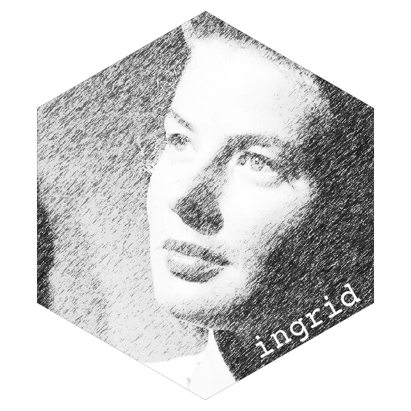

<!-- README.md is generated from README.Rmd. Please edit that file -->

```{r, include = FALSE}
knitr::opts_chunk$set(
  collapse  = FALSE,
  comment   = "#>",
  fig.path  = "man/figures/README-",
  out.width = "100%",
  fig.height = 2
)

library(grid)
library(ingrid)

#~~~~~~~~~~~~~~~~~~~~~~~~~~~~~~~~~~~~~~~~~~~~~~~~~~~~~~~~~~~~~~~~~~~~~~~~~~~~~
# Ensure that images are rendered using a device which understands patterns
#~~~~~~~~~~~~~~~~~~~~~~~~~~~~~~~~~~~~~~~~~~~~~~~~~~~~~~~~~~~~~~~~~~~~~~~~~~~~~
knitr::opts_chunk$set(dev.args = list(png = list(type = "cairo")))
```


```{r eval=FALSE, include=FALSE}
pkgdown::build_site(override = list(destination = "../coolbutuseless.github.io/package/ingrid"))
```

# ingrid  

<!-- badges: start -->

[](https://github.com/coolbutuseless/ingrid/actions/workflows/R-CMD-check.yaml)
<!-- badges: end -->

`ingrid` provides some tools that I find useful for creating/manipulating `grid`/`grob`.


The key benefits I get from `ingrid`:

*  **nested layout** `row` and `col` - similar to shiny UI definition
* **consistent interface to grob combination functions** (intersection, union etc)
  which work across `grobs`, `gTrees` and `polyclipgrobs`
* **verbose `print`** methods for grobs
* **inline graphical parameter specification**
* **Global, user-configurable `default.units`**

# Todo

* igt translate and rotate could work on both grobs and viewports?

## Vignettes

* [Creating the hex logo](https://coolbutuseless.github.io/package/ingrid/articles/logo.html)
* [Verbose grob output](https://coolbutuseless.github.io/package/ingrid/articles/verbose.html)
* [Grob creation](https://coolbutuseless.github.io/package/ingrid/articles/grob-creation.html)
* [Combining objects](https://coolbutuseless.github.io/package/ingrid/articles/combine.html)
* [Creating patterns](https://coolbutuseless.github.io/package/ingrid/articles/pattern.html)


## What's in the box 

* **`ig_*()`** grob creation functions with inline `gpar` specification
    * e.g. `ig_circle(r = .mm(10), fill = 'blue')`
* **`igc_*()`** grob **combination** operators
    * `igc_stack()`, `igc_intersect()`, `igc_union()`,  `igc_minus()`, `igc_xor()`
    * `igc_clip()`, `igc_mask()`
* **`igl_*()`** **layout** for multiple grobs
    * `igl_row()`, `igl_col()`, `igl_vp()`
* **`igt_*()`** **transform** operations on grobs
    * `igt_translate()`, `igt_rotate()`
    * `igt_update()` to update *any* parameter in the grob or viewport


<details>
<summary> Click here to reveal more details on what's included </summary>
* `ig_circle()` etc.  Analoges for the the grob creation functions in the
  `grid` package, but with a slight change in the argument defaults:
    * default.units are now 'mm' instead of 'npc'
    * the `gp` and `vp` objects are both created as fully realised structures,
      and no longer left as `NULL` if no values are given. This makes manipulation
      of grob objects a bit easier after they've been created.
* Set of functions for combining vanilla grobs, polyclipgrobs and gTree objects.
  These functions are mostly extensions of `gridGeometry::polyclipgrob()` which
  extends the operations to recurse into gTree and polyclipgrob structures to 
  affect all child objects:
    * `igc_stack()` for simple combination of shapes
    * `igc_intersect()` for shape intersection
    * `igc_union()` for shape union
    * `igc_minus()` for shape subtraction
    * `igc_xor()` for shape combination thruogh use of 'exclusive or'
* Functions for creating units quickly e.g `.mm(x)` instead of `units(x, 'mm')`
* Verbose printing of vanilla grob, gTree and polyclipgrob objects
* Structured printing of the grid pattern objects available in R4.1.0
* Simple grob coordinate transformations:
    * `igt_translate()`
    * `igt_rotate()`
* Simple viewport transformations:
    * `vp_translate()`
    * `vp_rotate()`
* `gp()` is a wrapper around `grid::gpar()` which is more friendly for 
  IDEs which support auto-complete.
* Some helpers for patterns:
    * S3 `print` methods with more structured output than `grid`'s default
    * `ig_pattern()` is a wrapper around `grid::pattern()` where:
        * `extend = 'repeat'` is the default (instead of 'pad')
        * `default.units` are in 'mm' (instead of 'npc')
        * location coordinates (x, y) are offset from the centre of the viewport
          by default.  Set `centred = FALSE` to disable this behaviour.

</details>

## Installation

You can install from [GitHub](https://github.com/coolbutuseless/ingrid) with:

``` r
# install.package('remotes')
remotes::install_github('coolbutuseless/ingrid')
```


# Nested object specification

`{ingrid}` reframes the grid layout functions into **nested hierarchical**
layout functions, somewhat similar to how `{shiny}` does it's UI layout.

* `igl_row()` will arrange its sub-elements in a horizontal row.
* `igl_col()` will arrange its sub-elements in a vertical column.
* `igl_vp()` will create an arbitrary viewport containing its sub-elements.

```{r fig.width = 3, fig.height = 3, out.width = 200, out.height = 200}
check <- igl_row(
  igl_col(
    ig_rect(fill = 'black'),
    nullGrob()
  ),
  igl_col(
    nullGrob(),
    ig_rect(fill = 'black')
  )
)

grid.newpage(); grid.draw(check)

check45 <- igl_vp(check, angle = 45)
grid.newpage(); grid.draw(check45)
```


```{r}
demo <- igl_row(
  ig_rect  (fill = ig_pattern(check  , width = .cm(1.5), height = .cm(1.5))),
  ig_circle(fill = ig_pattern(check  , width = .cm(2.5), height = .cm(2.5))),
  ig_rect  (fill = ig_pattern(check45, width = .cm(3  ), height = .cm(3  )))
)

grid::grid.newpage(); grid::grid.draw(demo)
```


# Combining grobs

Grobs may be combined with `igc_*()` functions.

* `igc_stack()` combines multiple grobs (as a `grobTree()`
* `igc_intersetion()`, `igc_union()`, `igc_xor()` and `igc_minus()` are 
   general set operations on grobs using `gridGeometry::polyclipGrob()` 
* `igc_combine()` is the core function used by the above set operators
* `igc_mask()` and `igc_clip()` use the new arbitrary clip and mask 
  functionality introduced in R4.1


```{r}
library(grid)
library(ingrid)

wug <- igc_intersect(
  igc_stack(
    ig_circle(r = .mm(20), fill = 'red', alpha = 0.3),
    ig_circle(r = .mm(33), x = .mid + .mm(25), fill = 'blue', alpha = 0.3),
    ig_circle(r = .mm( 2), x = .mid - .mm(13), y = .mid + .mm(4), fill='black', col='white')
  ),
  ig_circle(r = .mm(28), x = .mid - .mm(19), y = .mid - .mm(20), fill = 'lightblue', col = 'transparent', alpha = 0.3)
)
grid.newpage(); grid.draw(wug)
```


# Masking

`igc_mask()` and `igc_clip()` use the new arbitrary clip and mask 
  functionality introduced in R4.1


```{r fig.width = 3, fig.height = 3, out.width = 200, out.height = 200}
library(grid)
library(ingrid)

# Hex
r     <- .mm(20)
theta <- seq(30, 360, 60) * pi/180 
x     <- .mid + .mm(r * cos(theta))
y     <- .mid + .mm(r * sin(theta))
hex   <- ig_polygon(x, y, fill = 'blue')

# Random raster
ras <- ig_raster(
  image = matrix(runif(100), 10, 10)
)

# Draw individually
grid.newpage()
grid.draw(ras)
grid.draw(hex)

# Mask the raster with the hex
masked <- igc_mask(ras, hex)
grid.newpage(); grid.draw(masked)
```


## Transform grobs by translation/rotation

```{r fig.width = 8, fig.height = 3, out.width = 800, out.height = 300}
# Template object that will be adapted
rect <- ig_rect(width = .cm(2), height = .cm(2), col = 'grey20')

# create grobs
N <- 160
color <- rainbow(N)
grobs <- lapply(seq(N), function(i) {
  igt_translate(
    x = -.mid + .mm(3 * i),
    y = .inch(sin(i/4)),
    igt_rotate(
      angle = i * 2,
      igt_update(rect, fill = color[i])
    )
  )
})

# draw
grobs <- do.call(grid::grobTree, grobs)
grid.newpage(); grid.draw(grobs)
```


```{r fig.height = 6}
# Template object that will be adapted
rect <- ig_rect(width = .cm(1), height = .cm(1), col = 'white')


N     <- 160
color <- rainbow(N)

# Coords
r     <- .mm(40)
theta <- (seq(0, 360, length.out = N + 1) * pi/180 )[-1]
x     <- .mm(r * cos(theta + 0.2) + r * sin(3 * theta))
y     <- .mm(r * 0.8 * cos(2 * theta) + r * sin(theta))

# create grobs
grobs <- lapply(seq(N), function(i) {
  igt_translate(
    x = x[i],
    y = y[i],
    igt_rotate(
      angle = i * 5,
      igt_update(rect, fill = color[i])
    )
  )
})

# draw
grobs <- do.call(grid::grobTree, grobs)
grid.newpage(); grid.draw(grobs)
```


# Future

* Include grobs from other sources:
    * `ellipseGrob`, `ngonGrob` from [gridExtra](https://cran.r-project.org/package=gridExtra)


## Related Software

* [gridExtra](https://cran.r-project.org/package=gridExtra)
* grid - part of R  
* [gridGeometry](https://cran.r-project.org/package=gridGeometry)
* [polyclip](https://cran.r-project.org/package=polyclip)

## Acknowledgements

* R Core for developing and maintaining the language.
* CRAN maintainers, for patiently shepherding packages onto CRAN and maintaining
  the repository
