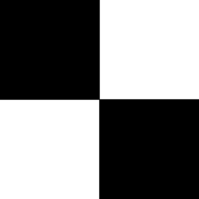
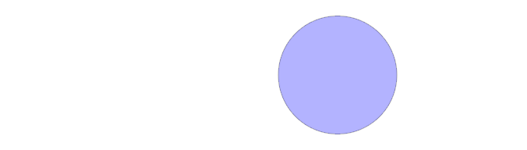
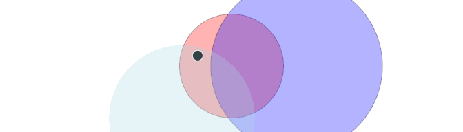

<!-- README.md is generated from README.Rmd. Please edit that file -->

# ingrid 

<!-- badges: start -->


<!-- badges: end -->

`ingrid` provides some tools that I find useful for
creating/manipulating `grid`/`grob` objects interactively in the
console.

The name `ingrid` stands for **IN**teractive **GRID**

The key benefits I get from `ingrid`:

-   verbose output of grobs, gTrees and polyclipgrobs, with much more
    output than their default `print` methods from `{grid}`
-   a suite of grob creation functions with inline gpar parameter
    specification.
-   `default.units` can be set globally to whatever the user wants, but
    default to ‘mm’
-   a consistent set of grob combination functions (e.g. intersection,
    minus) that work across single grobs, gTrees and polyclipgrobs

## Vignettes

-   [Creating the hex
    logo](https://coolbutuseless.github.io/package/ingrid/articles/logo.html)
-   [Verbose grob
    output](https://coolbutuseless.github.io/package/ingrid/articles/verbose.html)
-   [Grob
    creation](https://coolbutuseless.github.io/package/ingrid/articles/grob-creation.html)
-   [Combining
    objects](https://coolbutuseless.github.io/package/ingrid/articles/combine.html)
-   [Creating
    patterns](https://coolbutuseless.github.io/package/ingrid/articles/pattern.html)

## What’s in the box (Details, details, details)

|                         | grid                             | ingrid                                                                                                              |
|-------------------------|----------------------------------|---------------------------------------------------------------------------------------------------------------------|
| grob creation           | circleGrob(), rectGrob(), etc    | circle\_grob(), rect\_grob(), etc                                                                                   |
| default.units           | ‘npc’                            | getOption(‘ingrid.default.units’, ‘mm’)                                                                             |
| unit creation           | unit(10, ‘mm’)                   | .mm(10), .npc(), .points() etc                                                                                      |
| gpar creation           | gpar(fill = ‘red’)               | gp(fill = ‘red’) Has named arguments to support autocompletion.                                                     |
| pattern creation        | pattern() default extend = ‘pad’ | pattern\_creation() default extend = ‘repeat’                                                                       |
| grob combination        | gridGeometry::polyclipgrob()     | grob\_stack(), grob\_intersect(), grob\_union(), grob\_minus(), grob\_xor() supporting grobs, gTrees, polyclipgrobs |
| print()                 | print.grob() is terse            | verbose printing print.grob(), print.gTree(), print.polyclipgrob()                                                  |
| enable verbose printing |                                  | register\_verbose\_printing(), deregister\_verbose\_printing()                                                      |
| grob coord transforms   |                                  | grob\_translate(), grob\_rotate()                                                                                   |
| viewport updates        |                                  | vp\_translate(), vp\_rotate(), vp\_setmask(), vp\_setclip()                                                         |
|                         |                                  |                                                                                                                     |

<details>
<summary>
Click here to reveal more details on what’s included
</summary>

-   `grob_circle()` etc. Analoges for the the grob creation functions in
    the `grid` package, but with a slight change in the argument
    defaults:
    -   default.units are now ‘mm’ instead of ‘npc’
    -   the `gp` and `vp` objects are both created as fully realised
        structures, and no longer left as `NULL` if no values are given.
        This makes manipulation of grob objects a bit easier after
        they’ve been created.
    -   location coordinates (e.g. x, y) are offset from the centre of
        the viewport by default. Set `centred = FALSE` to disable this
        behaviour.
-   Set of functions for combining vanilla grobs, polyclipgrobs and
    gTree objects. These functions are mostly extensions of
    `gridGeometry::polyclipgrob()` which extends the operations to
    recurse into gTree and polyclipgrob structures to affect all child
    objects:
    -   `grob_stack()` for simple combination of shapes
    -   `grob_intersect()` for shape intersection
    -   `grob_union()` for shape union
    -   `grob_minus()` for shape subtraction
    -   `grob_xor()` for shape combination thruogh use of ‘exclusive or’
-   Functions for creating units quickly e.g `.mm(x)` instead of
    `units(x, 'mm')`
-   Verbose printing of vanilla grob, gTree and polyclipgrob objects
-   Structured printing of the grid pattern objects available in R4.1.0
-   Simple grob coordinate transformations:
    -   `grob_translate()`
    -   `grob_rotate()`
-   Simple viewport transformations:
    -   `vp_translate()`
    -   `vp_rotate()`
-   `gp()` is a wrapper around `grid::gpar()` which is more friendly for
    IDEs which support auto-complete.
-   Some helpers for patterns:
    -   S3 `print` methods with more structured output than `grid`’s
        default
    -   `pattern_create()` is a wrapper around `grid::pattern()` where:
        -   `extend = 'repeat'` is the default (instead of ‘pad’)
        -   `default.units` are in ‘mm’ (instead of ‘npc’)
        -   location coordinates (x, y) are offset from the centre of
            the viewport by default. Set `centred = FALSE` to disable
            this behaviour.

</details>

## Installation

You can install from [GitHub](https://github.com/coolbutuseless/ingrid)
with:

``` r
# install.package('remotes')
remotes::install_github('coolbutuseless/ingrid')
```

## Example - verbose grob output

In the code below, `circle` is created with `{grid}` and `circle2` is
created with `{ingrid}`.

There aren’t any major differences in how this creation works, but look
for:

-   default units for `ingrid::circle_grob` are ‘mm’
-   `gpar` parameters are given inline with the grob call (although it
    is also possible to pass in a `gp` argument)
-   by calling `ingrid::register_verbose_printing()` the output for
    `circle2` gives much more detail than the default printing.

``` r
library(grid)
library(ingrid)
```

#### Creating a blue circle in `{grid}`

``` r
#~~~~~~~~~~~~~~~~~~~~~~~~~~~~~~~~~~~~~~~~~~~~~~~~~~~~~~~~~~~~~~~~~~~~~~~~~~~~~
# Using 'grid'
#~~~~~~~~~~~~~~~~~~~~~~~~~~~~~~~~~~~~~~~~~~~~~~~~~~~~~~~~~~~~~~~~~~~~~~~~~~~~~
circle1 <- circleGrob(r = unit(20, 'mm'), gp = gpar(fill = 'lightblue'))
circle1
```

    #> circle[GRID.circle.1]

``` r
grid.newpage()
grid.draw(circle1)
```



#### Creating a blue circle in `{ingrid}`

``` r
#~~~~~~~~~~~~~~~~~~~~~~~~~~~~~~~~~~~~~~~~~~~~~~~~~~~~~~~~~~~~~~~~~~~~~~~~~~~~~
# Using 'ingrid' where default units are 'mm'
#~~~~~~~~~~~~~~~~~~~~~~~~~~~~~~~~~~~~~~~~~~~~~~~~~~~~~~~~~~~~~~~~~~~~~~~~~~~~~
circle2 <- circle_grob(20, fill = 'lightblue')
circle2
```

    #> circle[GRID.circle.2]

``` r
#~~~~~~~~~~~~~~~~~~~~~~~~~~~~~~~~~~~~~~~~~~~~~~~~~~~~~~~~~~~~~~~~~~~~~~~~~~~~~
# Enable verbose printing of grobs 
#~~~~~~~~~~~~~~~~~~~~~~~~~~~~~~~~~~~~~~~~~~~~~~~~~~~~~~~~~~~~~~~~~~~~~~~~~~~~~
ingrid::register_verbose_printing()
circle2
```

    #> circle [GRID.circle.2]
    #>   x=c(sum(0mm, 0.5npc)), y=c(sum(0mm, 0.5npc)), r=c(20mm)
    #>   gp: 
    #>     fill: lightblue
    #>   vp: [GRID.VP.1] default

``` r
grid.newpage()
grid.draw(circle2)
```


# Creating and combining grobs

``` r
library(grid)
library(ingrid)
register_verbose_printing()


#~~~~~~~~~~~~~~~~~~~~~~~~~~~~~~~~~~~~~~~~~~~~~~~~~~~~~~~~~~~~~~~~~~~~~~~~~~~~~
# Create 4 circles
#~~~~~~~~~~~~~~~~~~~~~~~~~~~~~~~~~~~~~~~~~~~~~~~~~~~~~~~~~~~~~~~~~~~~~~~~~~~~~
c1 <- circle_grob(r = 20, fill = 'red', alpha = 0.3)
grid.newpage(); grid.draw(c1);
```


``` r
c2 <- circle_grob(r = 33, x = 25, fill = 'blue', alpha = 0.3)
grid.newpage(); grid.draw(c2);
```



``` r
c3 <- circle_grob(r = 28, x = -19, y = -20, fill = 'lightblue', col = 'transparent', alpha = 0.3)
grid.newpage(); grid.draw(c3);
```


``` r
c4 <- circle_grob(r = 2, x = -13, y= 4, fill='black', col='white')
grid.newpage(); grid.draw(c4);
```


``` r
#~~~~~~~~~~~~~~~~~~~~~~~~~~~~~~~~~~~~~~~~~~~~~~~~~~~~~~~~~~~~~~~~~~~~~~~~~~~~~
# Stack some of the circles
#~~~~~~~~~~~~~~~~~~~~~~~~~~~~~~~~~~~~~~~~~~~~~~~~~~~~~~~~~~~~~~~~~~~~~~~~~~~~~
i1 <- grob_stack(c1, c2, c4)
grid.newpage(); grid.draw(i1);

#~~~~~~~~~~~~~~~~~~~~~~~~~~~~~~~~~~~~~~~~~~~~~~~~~~~~~~~~~~~~~~~~~~~~~~~~~~~~~
# Visualise how the 4th circle overlaps
#~~~~~~~~~~~~~~~~~~~~~~~~~~~~~~~~~~~~~~~~~~~~~~~~~~~~~~~~~~~~~~~~~~~~~~~~~~~~~
grid.newpage();
grid.draw(i1)
grid.draw(c3)
```



``` r
#~~~~~~~~~~~~~~~~~~~~~~~~~~~~~~~~~~~~~~~~~~~~~~~~~~~~~~~~~~~~~~~~~~~~~~~~~~~~~
# Keep just the intersection of the stack of 3 circls and the 4th circle
#~~~~~~~~~~~~~~~~~~~~~~~~~~~~~~~~~~~~~~~~~~~~~~~~~~~~~~~~~~~~~~~~~~~~~~~~~~~~~
wug <- ingrid::grob_intersect(i1, c3)
grid.newpage(); grid.draw(wug);
```


## logo for `ingrid`

``` r
library(grid)
library(ingrid)

#~~~~~~~~~~~~~~~~~~~~~~~~~~~~~~~~~~~~~~~~~~~~~~~~~~~~~~~~~~~~~~~~~~~~~~~~~~~~~
# Parameters for a hex
#~~~~~~~~~~~~~~~~~~~~~~~~~~~~~~~~~~~~~~~~~~~~~~~~~~~~~~~~~~~~~~~~~~~~~~~~~~~~~
r     <- 100
theta <- seq(30, 360, 60) * pi/180 
x     <- r * cos(theta)
y     <- r * sin(theta)

#~~~~~~~~~~~~~~~~~~~~~~~~~~~~~~~~~~~~~~~~~~~~~~~~~~~~~~~~~~~~~~~~~~~~~~~~~~~~~
# a hex polygon
#~~~~~~~~~~~~~~~~~~~~~~~~~~~~~~~~~~~~~~~~~~~~~~~~~~~~~~~~~~~~~~~~~~~~~~~~~~~~~
hex <- polygon_grob(x, y, fill = 'black')

#~~~~~~~~~~~~~~~~~~~~~~~~~~~~~~~~~~~~~~~~~~~~~~~~~~~~~~~~~~~~~~~~~~~~~~~~~~~~~
# Create an image maskeed by the hex
#~~~~~~~~~~~~~~~~~~~~~~~~~~~~~~~~~~~~~~~~~~~~~~~~~~~~~~~~~~~~~~~~~~~~~~~~~~~~~
jpg <- jpeg::readJPEG("./man/figures/ingrid.jpg")
image <- raster_grob(
  image  = jpg, 
  x      = .mm(-5),
  y      = .mm(-25),
  width  = .mm(2 * 1.0 * r), 
  height = .mm(3 * 1.0 * r),
  mask   = hex
)


#~~~~~~~~~~~~~~~~~~~~~~~~~~~~~~~~~~~~~~~~~~~~~~~~~~~~~~~~~~~~~~~~~~~~~~~~~~~~~
# Position text
#~~~~~~~~~~~~~~~~~~~~~~~~~~~~~~~~~~~~~~~~~~~~~~~~~~~~~~~~~~~~~~~~~~~~~~~~~~~~~
text <- text_grob(
  label      = 'ingrid',
  x          =  0.25 * r,
  y          = -0.75 * r, 
  rot        = 30,
  just       = 0,
  col        = 'white', 
  fontfamily = 'courier',
  cex        = 4
)

#~~~~~~~~~~~~~~~~~~~~~~~~~~~~~~~~~~~~~~~~~~~~~~~~~~~~~~~~~~~~~~~~~~~~~~~~~~~~~
# Draw the objects
#~~~~~~~~~~~~~~~~~~~~~~~~~~~~~~~~~~~~~~~~~~~~~~~~~~~~~~~~~~~~~~~~~~~~~~~~~~~~~
grid::grid.newpage()
grid::grid.draw(image)
grid::grid.draw(text)
```


# Future

-   Include grobs from other sources:
    -   `ellipseGrob`, `ngonGrob` from
        [gridExtra](https://cran.r-project.org/package=gridExtra)

## Related Software

-   [gridExtra](https://cran.r-project.org/package=gridExtra)
-   grid - part of R  
-   [gridGeometry](https://cran.r-project.org/package=gridGeometry)
-   [polyclip](https://cran.r-project.org/package=polyclip)

## Acknowledgements

-   R Core for developing and maintaining the language.
-   CRAN maintainers, for patiently shepherding packages onto CRAN and
    maintaining the repository
